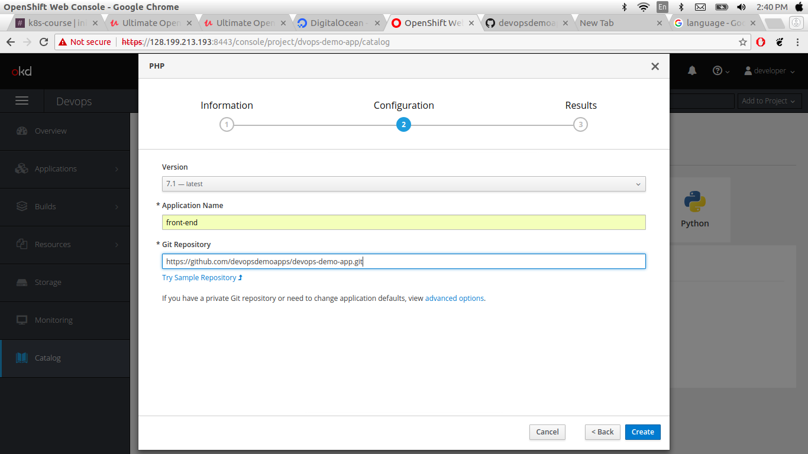
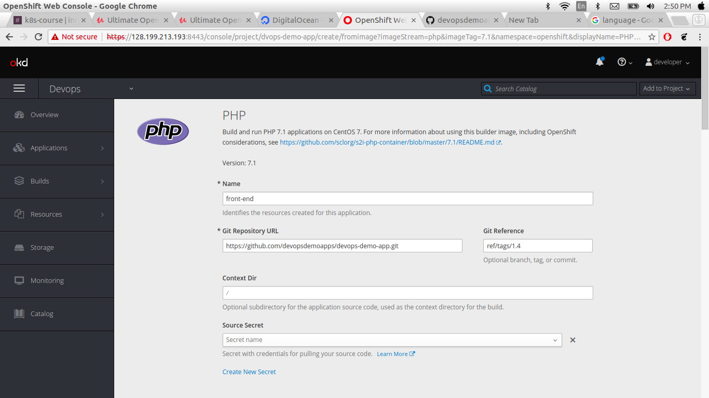
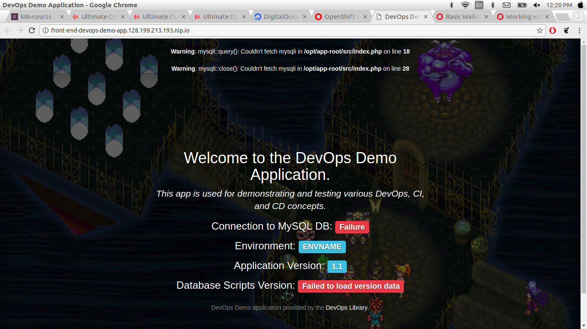

## Deploying Devops Demo PHP Application for GitHub Repo

In this section we are deploying sample devops demo PHP app from GitHub repo.
we use the same cluster earlier deployed simple aaplication with **myproject**  as  namespace/project.
This docs demonstrates how to get a simple project up and running on OpenShift. Application that will serve a welcome page Welcome to the DevOps Demo Application.

Make sure you have selected **myproject**. If not  switch  to it from web console.

* click the Browse catalog you can see here multiple programming languages and databases.
* select the php you can see here php+mysql and only php choose *php*


* After selecting the language provide the information ,
configuration

   * In configuration you can provides version of the programming language and following GitHub repo.

```
https://github.com/devopsdemoapps/devops-demo-app.git
```


* click on the advance options

In this section you can provides following options.
* reference

* Tag

* Routing

* Deployment Configuration

* scaling

* Resource Limit

* Labels



 Then click create project. After create project automated build build your project .
 In the web console, view the Overview page for your project to determine the web address for your application. Click the web address displayed right side web console open this link on new tab.

 


### Working with OpenShift CLI

```
 oc project myproject
 oc get pods
```

 [output]
```
 NAME                READY     STATUS      RESTARTS   AGE
frontend-1-build   0/1       Completed   0          22m
frontend-1-x59fd   1/1       Running     0          21m
```

 getting all replicas
```
 oc get rc
```
 [output]
```
 NAME          DESIRED   CURRENT   READY     AGE
frontend-1   1         1         1         22m
```

getting all services
```
 oc get svc
```

 [output]
```
 NAME        TYPE        CLUSTER-IP     EXTERNAL-IP   PORT(S)             AGE
frontend   ClusterIP   172.30.25.85   <none>        8080/TCP,8443/TCP   24m
```
 describe frontend services

```
 oc describe svc frontend
Name:              frontend
Namespace:         devops-demo-app
Labels:            app=frontend
Annotations:       openshift.io/generated-by=OpenShiftWebConsole
Selector:          deploymentconfig=frontend
Type:              ClusterIP
IP:                172.30.25.85
Port:              8080-tcp  8080/TCP
TargetPort:        8080/TCP
Endpoints:         172.17.0.8:8080
Port:              8443-tcp  8443/TCP
TargetPort:        8443/TCP
Endpoints:         172.17.0.8:8443
Session Affinity:  None
Events:            <none>
```

 getting deploymentconfig
```
 oc get dc
```
[output]
```
NAME        REVISION   DESIRED   CURRENT   TRIGGERED BY
frontend   1          1         1         config,image(frontend:latest)\

```

getting build
```
oc get build
```
[output]
```
NAME          TYPE      FROM          STATUS     STARTED          DURATION
frontend-1   Source    Git@6ef2140   Complete   29 minutes ago   34s

```
getting route
```
oc get route
```
[output]
```
NAME        HOST/PORT                                          PATH      SERVICES    PORT       TERMINATION   WILDCARD
frontend   frontend-devops-demo-app.128.199.213.193.nip.io             frontend   8080-tcp                 None
```
describe route
```
oc describe route frontend
```
[ouutput]
```
Name:			frontend
Namespace:		devops-demo-app
Created:		32 minutes ago
Labels:			app=frontend
Annotations:		openshift.io/generated-by=OpenShiftWebConsole
			openshift.io/host.generated=true
Requested Host:		frontend-devops-demo-app.128.199.213.193.nip.io
			  exposed on router router 32 minutes ago
Path:			<none>
TLS Termination:	<none>
Insecure Policy:	<none>
Endpoint Port:		8080-tcp

Service:	frontend
Weight:		100 (100%)
Endpoints:	172.17.0.8:8443, 172.17.0.8:8080

```
