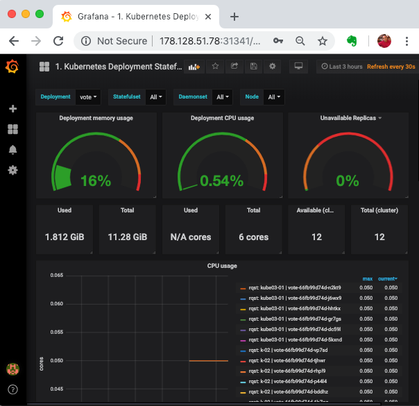
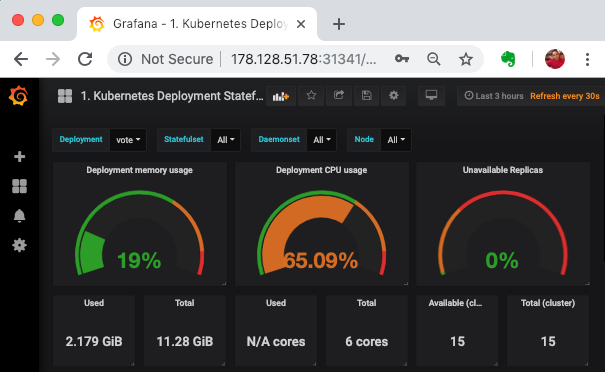

# Kubernetes Horizonntal Pod Autoscaling

With Horizontal Pod Autoscaling, Kubernetes automatically scales the number of pods in a replication controller, deployment or replica set based on observed CPU utilization (or, with alpha support, on some other, application-provided metrics).

The Horizontal Pod Autoscaler is implemented as a Kubernetes API resource and a controller. The resource determines the behavior of the controller. The controller periodically adjusts the number of replicas in a replication controller or deployment to match the observed average CPU utilization to the target specified by user

### Prerequisites

  * [Metrics Server](https://github.com/kubernetes-incubator/metrics-server).
  This needs to be setup if you are using kubeadm etc.  and replaces **heapster** starting with kubernetes version  1.8.
  * Resource Requests and Limits. Defining [CPU](https://kubernetes.io/docs/tasks/configure-pod-container/assign-cpu-resource/#specify-a-cpu-request-and-a-cpu-limit)as well as [Memory](https://kubernetes.io/docs/tasks/configure-pod-container/assign-memory-resource/) requirements for containers in Pod Spec is a must

#### Deploying Metrics Server

Kubernetes Horizontal Pod Autoscaler along with `oc adm top` command depends on the core monitoring data such as cpu and memory utilization which is scraped and provided by kubelet, which comes with in built cadvisor component.  Earlier, you would have to install a additional component called **heapster** in order to collect this data and feed it to the **hpa** controller. With 1.8 version of Kubernetes, this behavior is changed, and now **metrics-server** would provide this data. Metric server  is being included as a essential component for kubernetes cluster, and being incroporated into kubernetes to be included out of box. It stores the core monitoring information using in-memory data store.

If you try to pull monitoring information using the following commands
```
oc adm top pod

oc adm top node
```

it does not show it, rather gives you a error message similar to

[output]
```
Error from server (NotFound): the server could not find the requested resource (get services http:heapster:)
```

Even though the error mentions heapster, its replaced with metrics server by default now.

Deploy  metric server with the following commands,

```
cd ~
git clone  https://github.com/kubernetes-incubator/metrics-server.git
oc apply -f metrics-server/deploy/1.8+/
```

Validate
```
oc get deploy,pods -n kube-system
```

Monitoring has been setup.

##### Fixing issues with Metrics deployment

There is a known issue as off Dec 2018 with Metrics Server where is fails to work event after deploying it using above commands. This can be fixed with a patch using steps below.


To apply a patch to metrics server,

```
wget -c https://gist.githubusercontent.com/initcron/1a2bd25353e1faa22a0ad41ad1c01b62/raw/008e23f9fbf4d7e2cf79df1dd008de2f1db62a10/k8s-metrics-server.patch.yaml

oc patch deploy metrics-server -p "$(cat k8s-metrics-server.patch.yaml)" -n kube-system
```

Now validate with

```
oc adm top node
oc adm top pod
```

where expected output shoudl be similar to,

```
oc top node

NAME     CPU(cores)   CPU%   MEMORY(bytes)   MEMORY%
vis-01   145m         7%     2215Mi          57%
vis-13   36m          1%     1001Mi          26%
vis-14   71m          3%     1047Mi          27%
```


### Create a HPA

To demonstrate Horizontal Pod Autoscaler we will use a custom docker image based on the php-apache image

`file: vote-hpa.yaml`


```
apiVersion: autoscaling/v1
kind: HorizontalPodAutoscaler
metadata:
  name: vote
spec:
  minReplicas: 4
  maxReplicas: 15
  targetCPUUtilizationPercentage: 40
  scaleTargetRef:
    apiVersion: apps.openshift.io/v1
    kind: DeploymentConfig
    name: vote
```

apply

```
oc apply -f vote-hpa.yaml
```

Validate

```
oc get hpa

oc describe hpa vote

oc get pod,deploy


```

If you have a monitoring system such as grafana, you could also view the graphs for **vote** deployment.




###  Load Test

`file: loadtest-job.yaml`

```
apiVersion: batch/v1
kind: Job
metadata:
  name: loadtest
spec:
  template:
    spec:
      containers:
      - name: siege
        image: schoolofdevops/loadtest:v1
        command: ["siege",  "--concurrent=5", "--benchmark", "--time=10m", "http://vote"]
      restartPolicy: Never
  backoffLimit: 4
```

And launch the loadtest

```
oc apply -f loadtest-job.yaml
```

To monitor while the load test is running ,

```
watch oc top pods

```


To get information about the job

```
oc get jobs
oc describe  job loadtest

```

To check the load test output

```
oc logs  -f loadtest-xxxx
```
[replace **loadtest-xxxx** with the actual pod id.]


[Sample Output]

```
** SIEGE 3.0.8
** Preparing 15 concurrent users for battle.
root@kube-01:~# oc logs vote-loadtest-tv6r2 -f
** SIEGE 3.0.8
** Preparing 15 concurrent users for battle.

.....


Lifting the server siege...      done.

Transactions:		       41618 hits
Availability:		       99.98 %
Elapsed time:		      299.13 secs
Data transferred:	      127.05 MB
Response time:		        0.11 secs
Transaction rate:	      139.13 trans/sec
Throughput:		        0.42 MB/sec
Concurrency:		       14.98
Successful transactions:       41618
Failed transactions:	           8
Longest transaction:	        3.70
Shortest transaction:	        0.00

FILE: /var/log/siege.log
You can disable this annoying message by editing
the .siegerc file in your home directory; change
the directive 'show-logfile' to false.
```

Now check the job status again,

```
oc get jobs
NAME            DESIRED   SUCCESSFUL   AGE
vote-loadtest   1         1            10m

```

  * Keep monitoring for the load on the pod as the job progresses.
  * Keep a watch from grafana as well to see the resource utilisation for vote deployment.
  * You should see hpa in action as it scales out/in the  vote deployment with the increasing/decreasing load.


  


##### Summary

In this lab, you have successfull configured and demonstrated dynamic scaling ability of kubernetes using horizontalpodautoscalers. You have also learnt about a new **jobs** controller type for running one off or batch jobs.


##### Reading List

  * [Kubernetes Monitoring Architecture](https://github.com/kubernetes/community/blob/master/contributors/design-proposals/instrumentation/monitoring_architecture.md)
  * [Core Metrics Pipeline]( https://kubernetes.io/docs/tasks/debug-application-cluster/core-metrics-pipeline/)
  * [Metrics Server](https://github.com/kubernetes-incubator/metrics-server)
  * [Assigning Resources to Containers and Pods](https://kubernetes.io/docs/tasks/configure-pod-container/assign-cpu-resource/#specify-a-cpu-request-and-a-cpu-limit)
  * [Horizontal Pod Autoscaler](https://kubernetes.io/docs/tasks/run-application/horizontal-pod-autoscale/)
